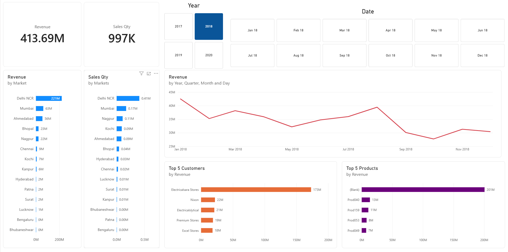

# 📊 Sales Insights Dashboard | Power BI + SQL

An end-to-end **Business Intelligence (BI)** project built using **Power BI** and **MySQL** to analyze sales performance for a fictional computer hardware company. The project transforms raw sales data into an interactive dashboard that helps business stakeholders monitor revenue, sales quantity, customer performance, and market trends in real time.

> **Tech Stack:** Power BI • MySQL • SQL • Power Query • DAX • Data Modeling

---

## 🚀 Project Overview

The Sales Director at **AtliQ Hardware** relied on multiple Excel reports to track business performance across different markets. The objective of this project was to replace manual reporting with an interactive Power BI dashboard that provides actionable insights into sales performance and enables data-driven decision making.

The project follows the complete analytics lifecycle:

- Data Discovery
- SQL Data Analysis
- Data Cleaning & Transformation (ETL)
- Data Modeling
- DAX Measure Creation
- Dashboard Design & Visualization
- Business Insights Generation

---

## 📷 Dashboard Preview

### Executive Sales Dashboard

---

## 🗂️ Data Model (Schema)

The dashboard uses a **Star Schema** with a central fact table connected to multiple dimension tables for customers, products, markets, and dates.

---

## 📌 Business Objectives

The dashboard answers key business questions such as:

- What is the overall sales revenue and sales quantity?
- Which markets contribute the highest revenue?
- Which customers generate the most revenue?
- What are the monthly and yearly sales trends?
- Which products perform best across different regions?
- How does revenue change over time?

---

## 📈 KPIs Tracked

| KPI | Description |
|------|-------------|
| 💰 Total Revenue | Overall revenue generated across all markets. |
| 📦 Sales Quantity | Total units sold. |
| 🌍 Revenue by Market | Revenue contribution by each city/market. |
| 👥 Top Customers | Highest revenue-generating customers. |
| 📅 Revenue Trend | Monthly and yearly revenue analysis. |
| 📊 Product Performance | Revenue and sales quantity by product. |

---

## 🛠️ SQL Analysis

Data exploration and validation were performed using **MySQL** before importing the data into Power BI.

### SQL Concepts Used

- `JOIN`
- `GROUP BY`
- Aggregate Functions (`SUM()`, `COUNT()`, `AVG()`)
- `CASE WHEN`
- Subqueries
- Common Table Expressions (CTEs)
- Sorting & Ranking
- Filtering using `WHERE` and `HAVING`

### Sample Business Questions Solved

- Total revenue by market.
- Top 10 customers by revenue.
- Monthly sales trend.
- Revenue contribution by product category.
- Sales quantity by region.

---

## 🔄 ETL with Power Query

Data was cleaned and transformed using **Power Query** before visualization.

Key transformations include:

- Removing duplicate records.
- Handling null values.
- Standardizing data types.
- Currency normalization.
- Renaming and formatting columns.
- Creating calculated columns for reporting.

---

## 📊 Data Modeling

A **Star Schema** was created to optimize report performance.

### Fact Table

- Sales Transactions

### Dimension Tables

- Customers
- Products
- Markets
- Date

Relationships were configured using one-to-many cardinality for efficient filtering and slicing.

---

## 🧮 DAX Measures

Several DAX measures were created to build dynamic KPIs and visualizations.

Examples include:

- Total Revenue
- Total Sales Quantity
- Revenue Growth %
- Profit Margin
- Year-to-Date Revenue
- Previous Year Revenue
- Dynamic KPI Cards

---

## 🎯 Dashboard Features

- Interactive slicers.
- Dynamic filters.
- Drill-through analysis.
- KPI Cards.
- Revenue trend visualization.
- Top-N customer and product analysis.
- Market-wise sales comparison.
- Responsive executive dashboard layout.

---

## 💡 Key Insights

Some business insights generated from the dashboard include:

- Revenue concentration across top-performing markets.
- Identification of declining sales regions.
- Customer contribution analysis for revenue optimization.
- Seasonal sales trends over multiple years.
- High-performing products and underperforming markets.

## 🧰 Tools & Technologies

| Tool | Purpose |
|------|---------|
| Power BI | Dashboard Development |
| MySQL | Data Storage & SQL Analysis |
| SQL | Data Exploration & Business Queries |
| Power Query | ETL & Data Cleaning |
| DAX | KPI Calculations & Measures |

---

## 📚 Skills Demonstrated

- Business Intelligence
- Data Analysis
- SQL Querying
- Data Cleaning
- ETL
- Data Modeling
- DAX
- Dashboard Design
- KPI Reporting
- Sales Analytics

---

## 👨‍💻 Author

**Aayush Rastogi**

Data Analyst | SQL | Power BI | Python | Excel

## Sales Insights Data Analysis Project

### Data Analysis Using SQL

1. Show all customer records

    `SELECT * FROM customers;`

1. Show total number of customers

    `SELECT count(*) FROM customers;`

1. Show transactions for Chennai market (market code for chennai is Mark001

    `SELECT * FROM transactions where market_code='Mark001';`

1. Show distrinct product codes that were sold in chennai

    `SELECT distinct product_code FROM transactions where market_code='Mark001';`

1. Show transactions where currency is US dollars

    `SELECT * from transactions where currency="USD"`

1. Show transactions in 2020 join by date table

    `SELECT transactions.*, date.* FROM transactions INNER JOIN date ON transactions.order_date=date.date where date.year=2020;`

1. Show total revenue in year 2020,

    `SELECT SUM(transactions.sales_amount) FROM transactions INNER JOIN date ON transactions.order_date=date.date where date.year=2020 and transactions.currency="INR\r" or transactions.currency="USD\r";`
	
1. Show total revenue in year 2020, January Month,

    `SELECT SUM(transactions.sales_amount) FROM transactions INNER JOIN date ON transactions.order_date=date.date where date.year=2020 and and date.month_name="January" and (transactions.currency="INR\r" or transactions.currency="USD\r");`

1. Show total revenue in year 2020 in Chennai

    `SELECT SUM(transactions.sales_amount) FROM transactions INNER JOIN date ON transactions.order_date=date.date where date.year=2020
and transactions.market_code="Mark001";`

Data Analysis Using Power BI
============================

1. Formula to create norm_amount column

`= Table.AddColumn(#"Filtered Rows", "norm_amount", each if [currency] = "USD" or [currency] ="USD#(cr)" then [sales_amount]*75 else [sales_amount], type any)`

